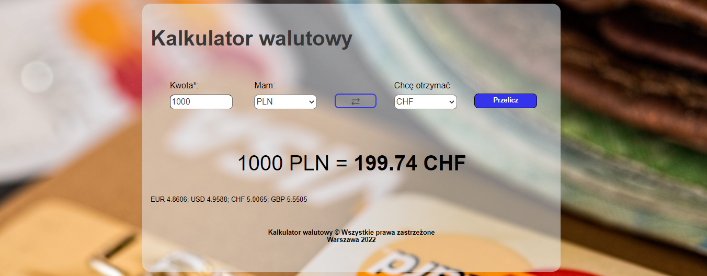

# Currency converter

## Demo
https://q270311.github.io/currency-converter/
## Description 
Project implemented during the _Frontend Developer od podstaw_ course at the **YouCode** -  online programming school.

This website will help you convert money from different currencies. You can choose from:
- Euro
- US Dollar
- Swiss Franc and 
- British Pound.

The **currency exchange rate is fixed and does not change over time**, to four decimal places.
Calculation result is displayed up to two decimal place

## Languages
 - HTML
 - CSS
 - BEM
 - FLEX
 - JavaScript
 - ES6+ features